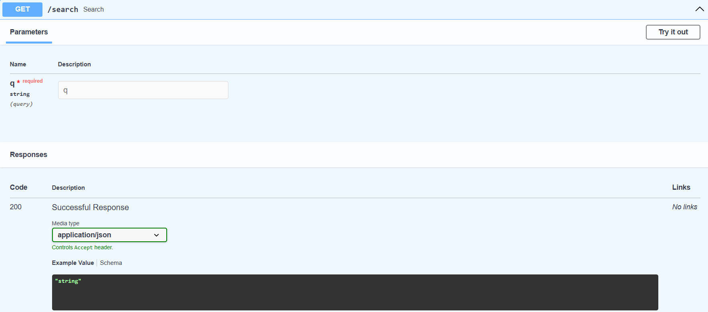
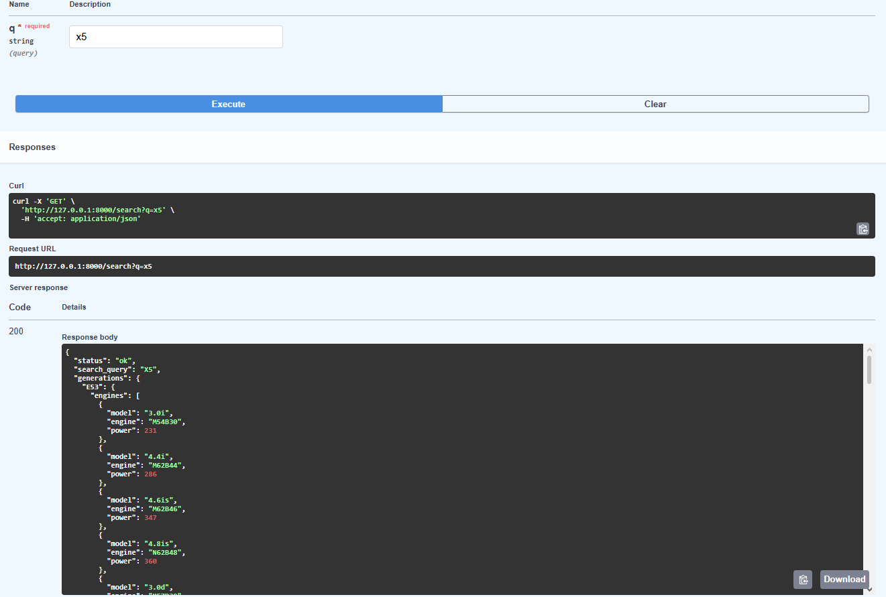

# Cars Data API

## Overview

Cars Data API is a backend project for querying BMW specifications such as models, generations, engines, and transmissions.

The project focuses on learning backend fundamentals by evolving from a simple script into a structured application with a layered architecture, query parsing, a relational database, and a REST API.

Development path:  
MVP → Layered Architecture → JSON Dataset → ETL → SQLite → Service Layer → REST API

---

## Current Features

- BMW dataset stored in JSON as source of truth (multiple series supported)
- SQLite database used for runtime queries
- CLI-based query interface
- REST API (FastAPI) for programmatic access
- Rule-based parsing using regex (model, fuel type, intent)
- Dynamic model and series detection based on database content
- Filtering by:
  - model generation (E90, F30, G20, etc.)
  - series (e.g. 3 Series, X5)
  - fuel type (petrol, diesel, hybrid)
- Support for multiple generations in a single query
- “Best engine” query support with reasoning
- Data seeding script (JSON → SQLite)

---

## REST API (FastAPI)

The project now exposes a REST API for external applications.

- Interactive docs: `/docs` (Swagger UI)
- Endpoint: `GET /search?q={query}`

### Example Usage

Request:
GET /search?q=x5

Response:

---

## How to Run

1. Clone the repository:

git clone https://github.com/Danio06/Cars-Data-API.git
cd Cars-Data-API

2. Create and populate the database:

python carsdatabase.py

(This will create cars.db and load data from datacars.json)

3. Run the API (FastAPI):

uvicorn main:app --reload

4. Visit:

http://127.0.0.1:8000/docs

5. (Optional) Run CLI version:

python app.py

---

## Example Usage

Ask: e90  
Returns full dataset for BMW E90

Ask: f30 petrol  
Returns petrol engines only

Ask: g20 best diesel  
Returns best diesel engine recommendation

Ask: 3 series  
Returns all available generations for BMW 3 Series

---

Type "exit" to quit (CLI mode).

---

## Project Structure

app.py  
CLI interface and output formatting

main.py  
FastAPI REST API layer

service.py  
Business logic and database queries

carparser.py  
Regex-based input parsing (model, fuel, intent)

carsdatabase.py  
ETL script for loading JSON data into SQLite

datacars.json  
Source dataset

cars.db  
SQLite database (generated locally)

---

## Tech Stack

Python 3  
FastAPI  
SQLite  
Uvicorn  
JSON  
Regex (pattern-based parsing)

---

## Architecture Overview

The project follows a layered backend design:

- Data Layer  
  JSON dataset + SQLite storage

- Parser Layer  
  Extracts model, fuel type, and intent from user input

- Service Layer  
  Handles SQL queries and response building

- Presentation Layer  
  - CLI for local usage  
  - FastAPI for REST API access  

---

## Data Pipeline

Data is loaded using a simple ETL process:

1. Extract  
   Read raw data from JSON

2. Transform  
   Normalize structure and handle missing values

3. Load  
   Insert into SQLite tables:
   - engines
   - best_engines
   - transmissions

---

## Key Improvements

- Refactored from single-file script to layered architecture
- Migrated from in-memory JSON to SQLite database
- Implemented regex-based query parsing
- Added REST API using FastAPI
- Added support for “best engine” logic with reasoning
- Built repeatable database seeding script
- Introduced dynamic model/series detection from database
- Added multi-generation query support

---

## Known Issues

- Parsing is rule-based and does not handle complex natural language
- No fuzzy matching or typo handling
- SQLite schema is not fully normalized
- Service layer mixes business logic with response formatting
- No logging or error tracking system

---

## Project Goals

- Learn backend architecture and separation of concerns
- Build a structured query system over real data
- Practice data transformation (JSON → SQL)
- Build and expose a REST API using FastAPI
- Prepare for large-scale data expansion (web scraping)

---

## Status

In progress  
Project now includes a working REST API.  
Next step: expand dataset using web scraping and scale to more car brands.
